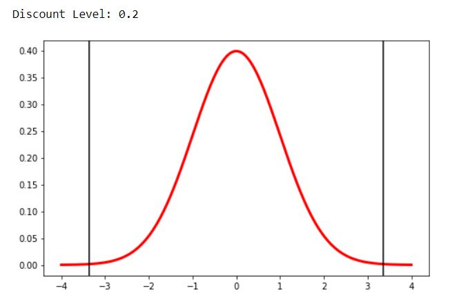
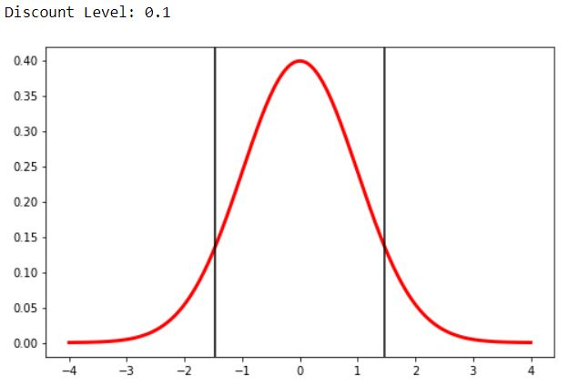
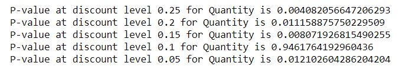
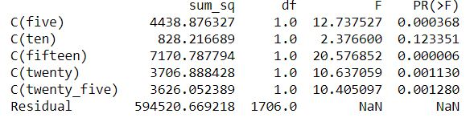

# Hypothesis Testing with the Northwind Database Using SQL
## Flatiron School's Module 2 Project

### Objective
Students needed to generate 3 hypotheses to test using the Northwind Database. An example of a hypothesis would be the following: *Do discounts have a 
statistically significant effect on the number of products customers order*?

A downsized version of the Northwind database was utilized to reduce computing time, and a schema for the data can be found below:

### Deliverables

1. A detailed Jupyter notebook showing all code and work
2. A blog post about the project or an aspect of the project
3. A pdf version of the presentation delivered to the instructor

## Table of Contents

- Final Project Blog.docx - Word file of blog
- Instructions.md - text file outlining the official instructor instructions for the project
- Nguyen_Thien_Presentation_mod_2.pdf - powerpoint presentation of the project
- Northwind_small_.sqlite - a small version of the Northwind Database
- Thien_Nguyen_Mod_2_Project - detailed notebook of the investigation

## Methodology

For each question a null and alternative hypothesis was first established. Then, a SQL query was executed with pandas' read sql query function and loaded into a dataframe. The data was then cleaned
and scrubbed before a T-test (either two-tailed or one-tailed) was used along with ANOVA to determine statistical significance. 

### Questions
Listed are the questions chosen for hypothesis testing. 

1. Do discounts have an effect increasing or decreasing the amount of products customers order?
2. Do certain employees do better or worse in quantity of items sold?
3. Do consumers prefer to buy certain categories of items more than others?
4. Do shipping companies affect the downtime between order and shipment?

### Example - Question 1 - Discounts

Perform a two-tailed T-test on each level of discount (five total). Some showed statistical significance, such as the 20% discount:

while the 10 percent discount category showed no statistical significance:

To confirm, p-values were checked for all discount levels, which confirmed what the visualizations indicated:

In addition, ANOVA was also used:

## Results Summary

#### Q1. Do discounts have an effect on the number of products customers order? If so, at what level of discounts?
With the control group set as no discount. Two sample t-test and ks-test confirms that **discount has a statistically signficant effect on the number of products customers order for all discount levels, except .1 (Ie. 10% discount)**

#### Q2. Do certain employees do better or worse than others in quantity of items sold in each order? If so, who seems to do the best?
Depending on which employee was set as the control group, the null hypothesis could be accepted or rejected with t-testing. However, ANOVA with all employees determined that four employees--**Buchanan, Leverling, Fuller, and King** have a significant impact on the quantity of items sold.

#### Q3. Do consumers buy certain categories of items more than other? If so, which categories?
Again, the null hypothesis could be accepted or rejected depending on which group served as the control group. With ANOVA,five categories, **Beverages, Condiments, Dairy Products, Meat, and Seafood**, were found to have a significant impact on quantity purchased by consumers.

#### Q4. Does shipping company affect the downtime between order and shipment? If so, which shipping companies ship the fastest?
Both t-test and ANOVA found that **Federal Shipping** had significantly faster shipping times.
